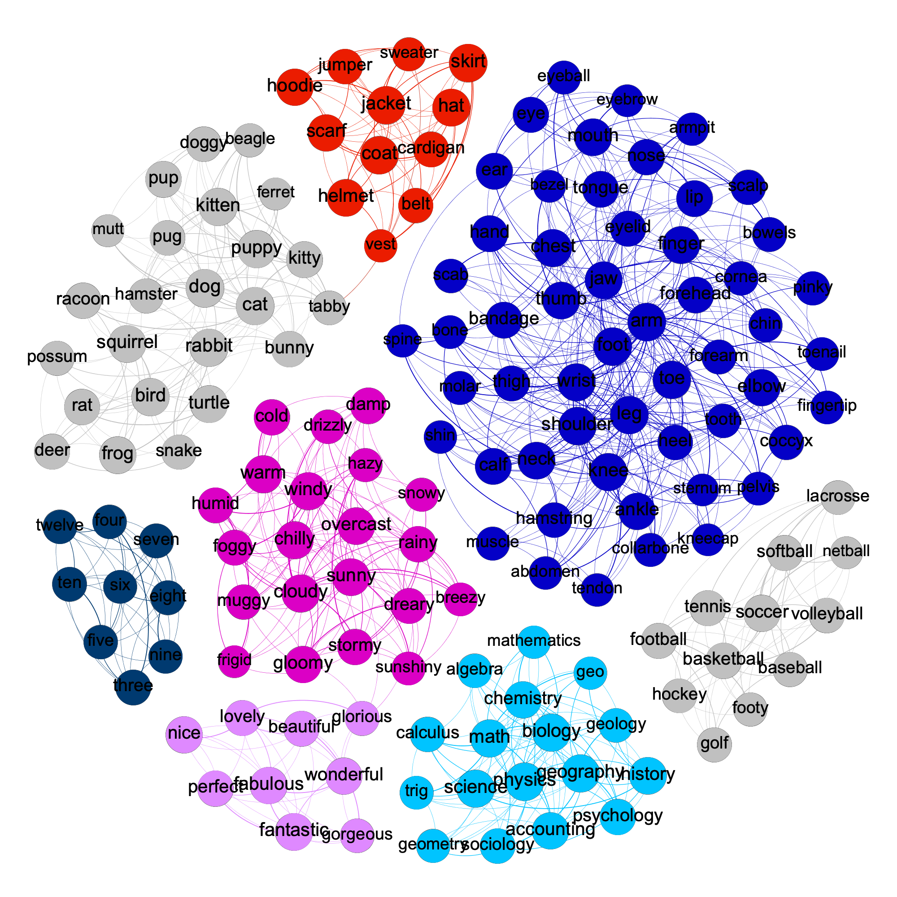

# Network Analysis of Word Vectors

This project is a part of semester credits in Social Network Analysis. As per project requirements, the main code and visualizations are in IPython notebooks. The gephi visualizations are in `img` directory. Listed below are the files in the repository with description

* `report.pdf` gives a brief overview of the project with results.
* `network.gexf` is the network file to be opened with [gephi](https://gephi.org).
* `Notebooks/createNetwork.ipynb` : Use trained word embeddings to create a network.
* `basic statistics.ipynb` : Measures stats of the network eg. Degree Distribution, Centrality etc.
* `network diffusion.ipynb` : Network-based diffusion analysis (SIR, SIS, SI, etc.)
* `CD.ipynb`: Community Discovery. Includes Girvan-Newman, Louvain, Label Propagation, k-clique and Demon. Compares partition across them. 

#### Requirements

The codes are heavily utilizing [NDlib](https://ndlib.readthedocs.io/en/latest/) and [networkX](https://networkx.org) which can be installed using

`$pip install ndlib networkx` 

#### Dataset

The dataset used for the creation of word-embedding is [Sentiment140 dataset](https://www.kaggle.com/kazanova/sentiment140). Sentiment140 is a collection of 1.6 million tweets extracted using the Twitter API.  